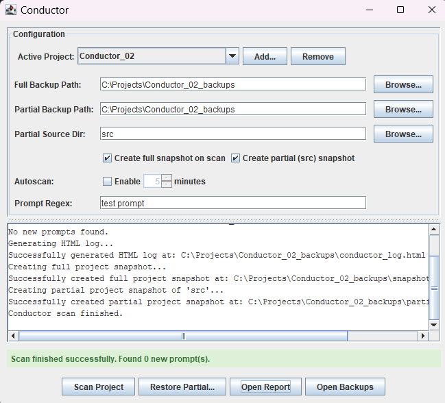
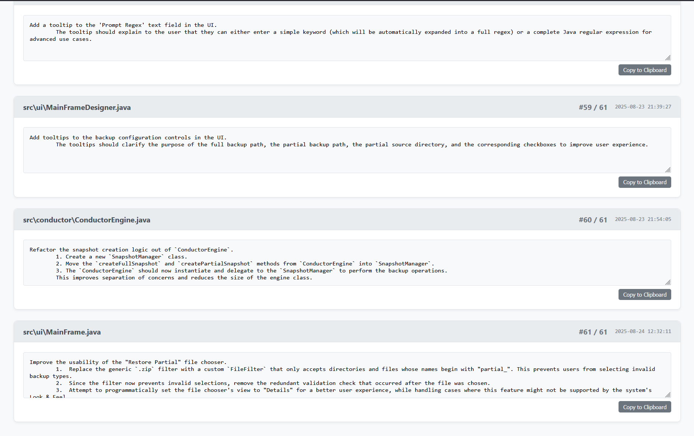
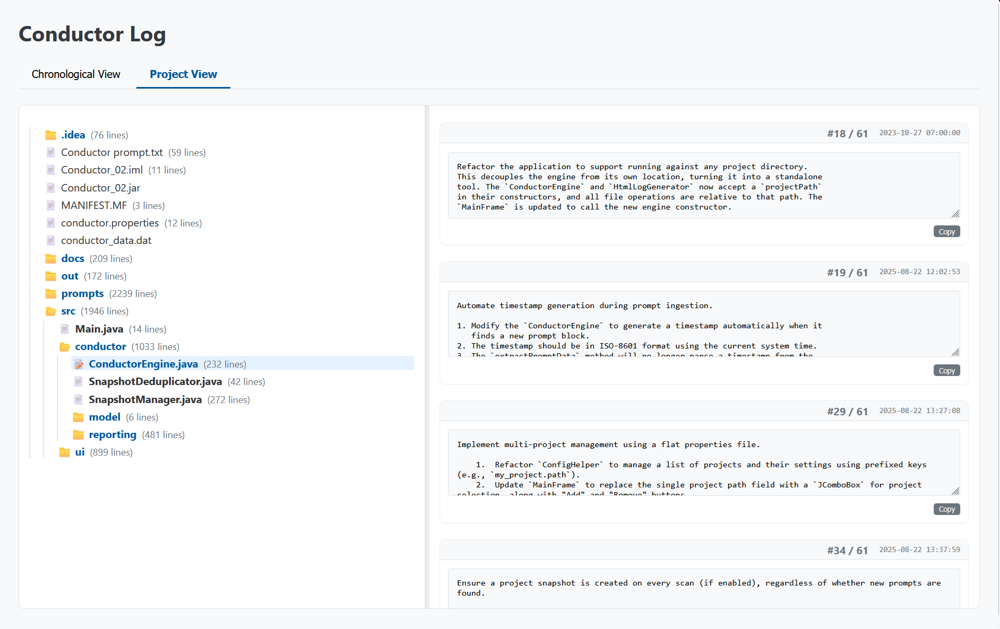

# Conductor: A Development Flight Recorder

Conductor is a unique Java-based desktop tool designed to act as a "flight recorder" for your software development process, regardless of the operating system or programming language. It helps you document the *why* behind your code by embedding development prompts directly into your source files, which are then ingested, logged, and removed, leaving your code clean.

## Why Conductor?

Modern AI code assistants are powerful, but they can sometimes struggle with complex refactoring tasks, potentially damaging a codebase beyond easy repair. A simple "undo" or "roll back last changes" command often fails to capture the full context of an AI-driven session.

Conductor was born from this need for a more robust safety net and a formal record of the development process. It's more than just a backup tool; it's a **prompt refiner, archivist, and analyzer**. By capturing the refined *intent* of a development task *before* it's executed, Conductor creates a verifiable history that can be reviewed and restored.

This makes it distinct from simple "prompt libraries" and opens up new possibilities, such as using the detailed logs as a teaching tool in mentor-pupil environments to demonstrate effective AI collaboration.

## Core Philosophy

The goal of Conductor is to seamlessly integrate AI-assisted development into a project's permanent history. The primary workflow is not just about manual note-taking, but about formalizing the collaboration between a developer and their AI coding assistant.

You discuss a task with your assistant and refine the implementation strategy. To conclude the dialogue, the developer instructs the assistant to generate a clean, concise prompt summarizing the agreed-upon change. The assistant then places this prompt directly into the source code. Conductor then acts as an automated archivist: it ingests the prompt, cleans it from the source, and preserves it in a rich, interactive logbook, creating a verifiable "flight record" of your AI-driven development journey. Manual prompts insertions are still a convenient feature, but the core idea is to capture the *intent* born from developer-AI collaboration.

*It remains to be seen if this complete prompts log could be used by an AI agent to fully replicate the documented project... an experiment with the Kolmogorov 'minimal program that generates a program' principle.* :-)

## Features

-   **Prompt-Driven Development**: Embed tasks, notes, or prompts directly in your source code using configurable markers (e.g., `/* @@TASK ... @@END_TASK */`).
-   **Automatic Source Cleaning**: After a prompt is ingested, it's automatically removed from the source file, keeping your production code free of clutter.
-   **Interactive HTML Logbook**: Generates a detailed `conductor_log.html` file with two powerful views:
    -   **Chronological View**: A complete, time-ordered history of every prompt across the entire project.
    -   **Project View**: A collapsible file tree of your project, highlighting files with prompt history. Clicking a file displays all of its associated prompts.
-   **Project Snapshots & Restore**:
    -   Create **full** backups of the entire project directory.
    -   Create **partial** backups of a specific subdirectory (like `src`).
    -   Intelligent de-duplication prevents storing identical backup files.
    -   Safely **restore** a partial backup, which automatically creates a pre-restore backup of the current state first.
-   **Multi-Project Support**: Manage configurations for multiple different software projects from a single interface.
-   **Configurable & Automated Scanning**:
    -   A Swing-based GUI for easy configuration and manual scanning.
    -   An **autoscan** feature to run scans automatically at a defined interval, with a live countdown timer.
    -   An integrated console panel to view live application output.

## How It Works

The typical modus operandi is simple: a developer starts Conductor and points it to their project directory. With autoscan enabled, the tool works silently in the background, watching for prompts, creating backups, and documenting progress. It remains invisible until you need it.

The core workflow is as follows:

1.  **Write a Prompt**: In any source file, add a comment block that matches your configured prompt regex. The tool is language-agnostic. For example, using the default settings for a Java-style comment:
    ```java
    /* @@TASK
    Refactor this method to improve performance.
    @@END_TASK */
    public void someMethod() { ... }
    ```
    By changing the regex, you can easily adapt it for other languages like Python:
    ```python
    """ @@TASK
    Refactor this function to improve performance.
    @@END_TASK """
    def some_function():
        ...
    ```
2.  **Run a Scan**: Use the Conductor UI to "Scan Project" (manually or via autoscan).
3.  **Ingest & Clean**: Conductor finds the prompt, saves it to its internal database (`conductor_data.dat`), and removes the block from the source file.
4.  **Report & Backup**: It then regenerates the HTML logbook with the new entry and, if configured, creates a full or partial project backup.

The result is a clean codebase and a rich, external history of your development journey.

## Screenshots

### Main User Interface


### HTML Log: Chronological View


### HTML Log: Project View
